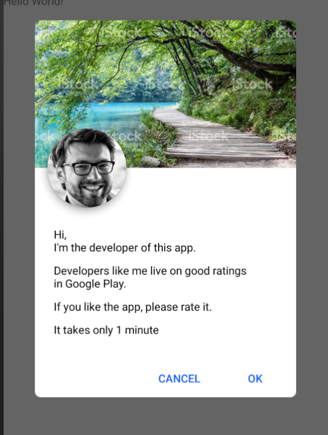

[](https://jitpack.io/#stanwood/Dialog_Framework_android)
[](https://android-arsenal.com/api?level=21)

# stanwood Rating Dialog (Android)

This library contains a simple to use "please rate my app" dialog, which is shown at x-th time of app starts.



## Import

The stanwood Rating Dialog is hosted on JitPack. Therefore you can simply import it by adding

```groovy
allprojects {
    repositories {
        ...
        maven { url "https://jitpack.io" }
    }
}
```

to your project's `build.gradle`.

Then add this to you app's `build.gradle`:

```groovy
dependencies {
    implementation 'com.github.stanwood:Dialog_Framework_android:<insert latest version here>'
}
```

For more info about how to add Stanwood analytics framework to the app please check the 
https://github.com/stanwood/Analytics_Framework_android

## Usage

Initialise the dialog within Application and set after how many app starts would you want to show the dialog.

```java
public class MyApp extends Application implements HasActivityInjector {
    @Inject
    DispatchingAndroidInjector<Activity> dispatchingAndroidInjector;

    @Inject
    RatingService ratingService;
    
    @Override
    public void onCreate() {
        super.onCreate();
        DaggerAppComponent.builder().application(this).build().inject(this);
        ratingService.setLaunchTimes(2);
    }
    
    @Override
    public DispatchingAndroidInjector<Activity> activityInjector() {
        return dispatchingAndroidInjector;
    }
}
```

Show the dialog within Activity

```java
public class MainActivity extends AppCompatActivity {

    @Inject
    RatingService ratingService;
    
    @Override
    protected void onCreate(Bundle savedInstanceState) {
        super.onCreate(savedInstanceState);
        AndroidInjection.inject(this);
    
        setContentView(R.layout.activity_main);
        if (ratingService.shouldBeDisplayed()) {
             RatingDialog.builder()
                     .addParagraph(Html.fromHtml("Hi, <br/> I'm the <font color='red'>developer</font> of this app."))
                     .addParagraph("Developers like me live on good ratings in Google Play.")
                     .addParagraph("If you like the app,\nplease rate it.")
                     .addParagraph("It takes only 1 minute")   
                     .setCancelText("Cancel")
                     .setOkText("Ok")
                     .setBannerUrl("https://media.istockphoto.com/photos/plitvice-lakes-picture-id500463760?s=2048x2048")
                 	 // alternatively: .setBannerDrawable(bannerDrawableResId)
                     .setFaceUrl("https://lh5.googleusercontent.com/-_w2wo1s6SkI/AAAAAAAAAAI/AAAAAAAAhMU/s78iSxXwVZk/photo.jpg")
                 	 // alternatively: .setFaceDrawable(bannerDrawableResId)
                     //.setAnalyticsTracker(add analytics instance here)
                     .preloadAndShow(this);
            		 // alternatively just .show(this) if you don't need to preload images (e.g. because you provide them locally via Drawable resources)
            }
        }
    }
```

Min SDK Version = 21

Glide version = 4.8.x

For more information check out the sample app.

## Tips and Tricks

**Fixed in 0.6.1:** Firebase remote config does not support newlines by ifself. Here's a snippet which solves it:

```java
public String getString(@ConfigName String key) {
    return mFirebaseRemoteConfig.getString(key);
}

public String getNewLinedString(@ConfigName String key) {
    String s = getString(key);
    if (s != null) {
        return s.replaceAll("\\\\n", "\n");
    } else {
        return s;
    }
}
```

## Roadmap

- add more possibilities about when to show the dialog